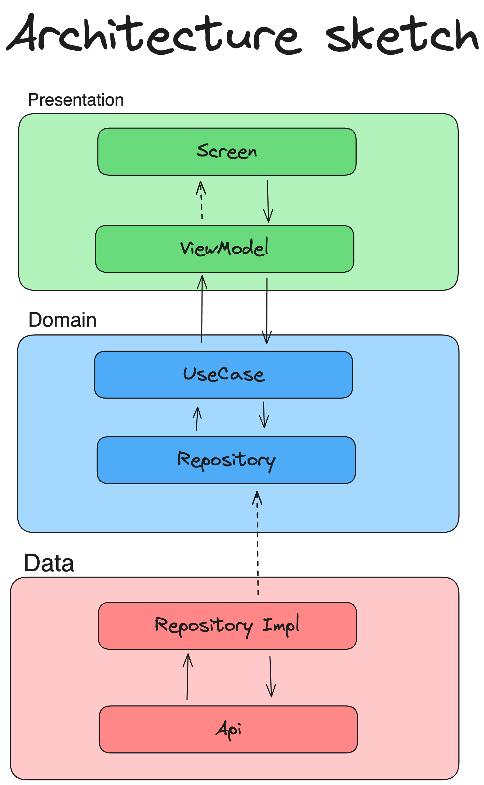

# CleanArchCrypto

## Sobre esse projeto
Esse projeto consiste em um visualizador de informações sobre as principais criptomoedas do mercado. 
Ele utiliza a [Api CoinPaprika](https://api.coinpaprika.com/) para obter as informações e foi construido com o objetivo de estudar sobre Clean Architecture e Jetpack Compose.

## Arquitetura
Para esse projeto foi utilizado a Clean Architecture, e abaixo temos um rascunho da implementação

## O que aprendi
- Diferenças entre um projeto que utiliza Jetpack Compose e XML
- Temas e estilos no Jetpack compose
- Clean Architecture e a responsabilidade da camada de Domain
- Hilt para injeção de dependências

## Bibliotecas utilizadas
- Jetpack Compose (Jetpack Components)
- ViewModel (Jetpack Components)
- Hilt (Injeção de dependencias)
- Material Compose
- Kotlin Coroutines
- Kotlin Flows
- Retrofit 